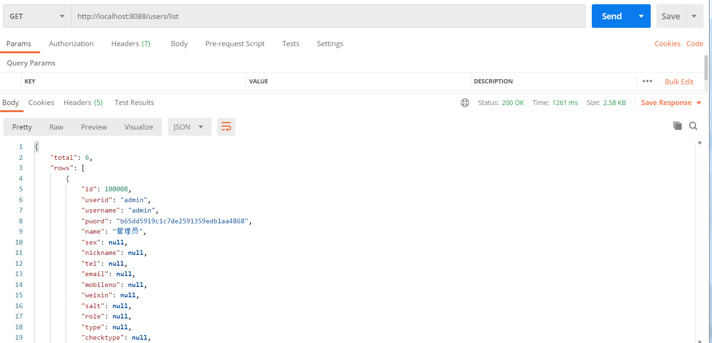

GenCode
=========
**GenCode** generate code automatically !  
Spring boot restful back end mvc code.  
Controller/Action + service (+ dao).  

**Bee** is an ORM framework.   
**Bee** is an easy and high efficiency ORM framework.   
Bee is a Java ORM framework for the new era of the internet, which supports Sharding.   
It supports various relational databases, as well as NoSQL databases such as Cassandra and MongoDB (V2.1).
Bee is faster, simpler, and more automated, allowing for faster development and execution, and it is also more intelligent.   
It supports multiple relational databases, including MySQL,MariaDB,Oracle,H2,SQLite,PostgreSQL,SQL Server,Access.   

### **V2.1.8** 
1. Bee supports generating Swagger annotations when generating Javabeans 
2. Bee multi table association supports insertion, update, and deletion 


quick start:
=========	
## 1.add dependency   
```xml
		<dependency>
			<groupId>org.teasoft</groupId>
			<artifactId>gencode</artifactId>
			<version>2.2</version>
			<type>pom</type>
		</dependency>
```

## 2.Just one line for gen CRUD   

```java
public static void main(String[] args) {
	GenCode.genRestRich("users", "com.abc");
}
```

## 3.Detail: 

```java
	public static void main(String[] args) {
		
		//1.准备工作，
//		1) 需要准备一个spring boot工程。
//		可以下载springbootDemo.zip(使用spring boot 2.7.12)
//		2)  在bee.properties配置了数据库的连接， 且数据库已创建有表(例子是使用users表)
		
		//2. 生成Rest (Controller/Action)文件  Restful风格的MVC后端代码，前后端分离
//		GenCode.genRestRich("users", "com.abc");//"users":表名，"com.abc"：包名
//		GenCode.genRestRichWithCodeMsg("users", "com.abc");//genRestRichWithCodeMsg生成的Rest类，是用指定的编码和信息，适用于大型项目
		GenCode.genRestRichWithCodeMsg("users", "com.abc","com.abc.comm");//"users":表名，"com.abc"：包名， "com.abc.comm"：指定自定义的Const名所在的包
		
		//3.在Application类，指定你生成的包名(生成的Restful代码没包含在Application类的路径下，则需要配置)
		//@ComponentScan({"com.abc"})
		
		//4.启动Application,访问：
		//http://localhost:8088/users/list
		//即可看到数据。
		
		
//		GenCode.genOneJavabean("users"); //单独生成Javabean,默认放在包entity
	}
	
```

illustration
=========	
## 1. gen-before:  
  

## 2. gen-after:  
  

## 3. test with postman:  
  


**Bee** :  
https://github.com/automvc/bee  

**Bee on gitee** :  
https://gitee.com/automvc/bee
