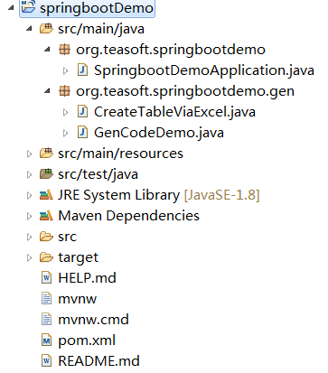
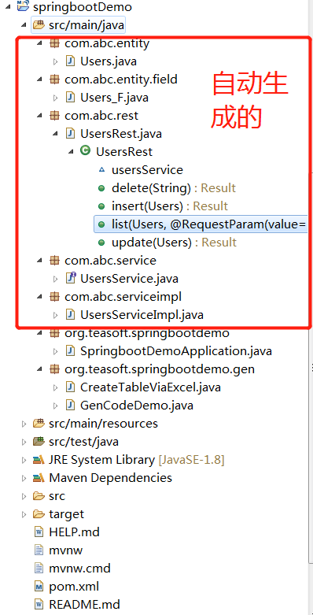
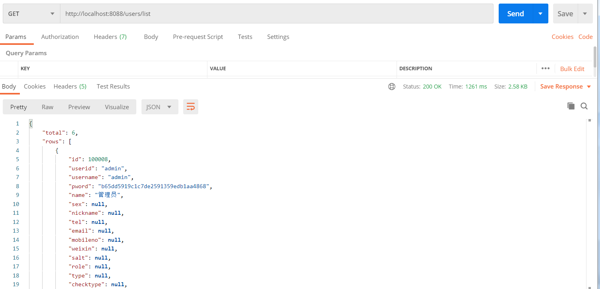

GenCode
=========
**GenCode** 是基于Bee的一个快速生成代码工具！  
支持生成restful风格的后端代码.  
Controller/Action + service (+ dao).  

Bee，互联网新时代的 Java ORM 框架，支持 Sharding；JDBC，Android，HarmonyOS；支持多种关系型数据库，还支持 NoSQL 的 Cassandra，Mongodb(V2.1) 等；更快、更简单、更自动，开发速度快，运行快，更智能！  
支持多种关系型数据库：MySQL,MariaDB,Oracle,H2,SQLite,PostgreSQL,SQL Server,Access 等。     

快速开始:
=========	
## 1.添加依赖     
```xml
		<dependency>
			<groupId>org.teasoft</groupId>
			<artifactId>gencode</artifactId>
			<version>2.1.7</version>
			<type>pom</type>
		</dependency>
```

## 2.只一行Java代码,即可生成CRUD后端代码     

```java
public static void main(String[] args) {
	GenCode.genRestRich("users", "com.abc");
}
```

## 3.Detail: 

```java
	public static void main(String[] args) {
		
		//1.准备工作，
//		1) 需要准备一个spring boot工程。
//		可以下载springbootDemo.zip(使用spring boot 2.7.12)
//		2)  在bee.properties配置了数据库的连接， 且数据库已创建有表(例子是使用users表)
		
		//2. 生成Rest (Controller/Action)文件  Restful风格的MVC后端代码，前后端分离
//		GenCode.genRestRich("users", "com.abc");//"users":表名，"com.abc"：包名
//		GenCode.genRestRichWithCodeMsg("users", "com.abc");//genRestRichWithCodeMsg生成的Rest类，是用指定的编码和信息，适用于大型项目
		GenCode.genRestRichWithCodeMsg("users", "com.abc","com.abc.comm");//"users":表名，"com.abc"：包名， "com.abc.comm"：指定自定义的Const名所在的包
		
		//3.在Application类，指定你生成的包名(生成的Restful代码没包含在Application类的路径下，则需要配置)
		//@ComponentScan({"com.abc"})
		
		//4.启动Application,访问：
		//http://localhost:8088/users/list
		//即可看到数据。
		
		
//		GenCode.genOneJavabean("users"); //单独生成Javabean,默认放在包entity
	}
	
```

效果图
=========	
## 1. 自动生成代码前:  
  

## 2. 自动生成代码后:  
  

## 3. 使用postman测试:  
  


**Bee** 网址:  
https://github.com/automvc/bee  

**Bee在gitee** 的网址:  
https://gitee.com/automvc/bee
